---

---

##  STOCK MANAGEMENT USERGUIDE

[TOC]

### 1.引言

目前STOCK MANAGEMENT 这个APP是针对上海优家的业务来开发的，优家是一个做家居行业的公司，所用的管理系统是SAP BUSINESS ONE。优家的仓管人员对于家具物料进行仓库管理非常的麻烦，面对大型的家具以及打包的家具仓管人员通过手工的录入这些物料耗费时间以及人力，而目前我们做的这个APP可以通过扫码的方式来录入物料可以通过移动端来完成库存任务，以及库存任务汇报，可以很好的解决优家仓库管理存在的诸多问题。

#### 1.1 项目名称

仓库管理/STOCK MANAGEMENT

#### 1.2 编写目的

主要介绍仓库管理客户端APP实现的的业务以及操作方法。预期读者：开发人员，项目管理人员，最终用户人员。

#### 1.3 系统环境配置

#### 1.4按钮定义

在APP上出现的按钮如下

| 按钮名称 | 按钮形状                                                     | 按钮含义                             |
| -------- | ------------------------------------------------------------ | ------------------------------------ |
| 后退按钮 |                             | 后退到上一层页面或者是取消当前操作   |
| 前进按钮 |             | 完成当前操作以后选择下一步的按钮     |
| 保存按钮 |  | 最后一步操作，保存当前页面的单据信息 |
| 添加按钮 |  | 手动来添加物料                       |
| 扫描按钮 |  | 通过扫码的方式添加物料               |

### 2. 功能概述

#### 2.1 功能结构

仓库管理主要分为APP客户端（安卓版），后台管理两部分，APP客户端（主要包含库存任务、库存汇报两个功能模块），后台包括（）。其中仓库管理APP示意图如下：

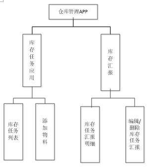

​                                                                           图 2.1 功能结构图

### 3.功能说明

#### 3.1 登录功能

##### 3.1.1 功能说明

该功能主要是验证用户信息，设置账套名称。

##### 3.1.2 操作步骤

用户打开APP，如已有账套，直接输入用户名和登录密码，后台验证用户信息，如果没有账套则需要在高级设置里设置账套信息。                                                                                                                                                                   

​                                      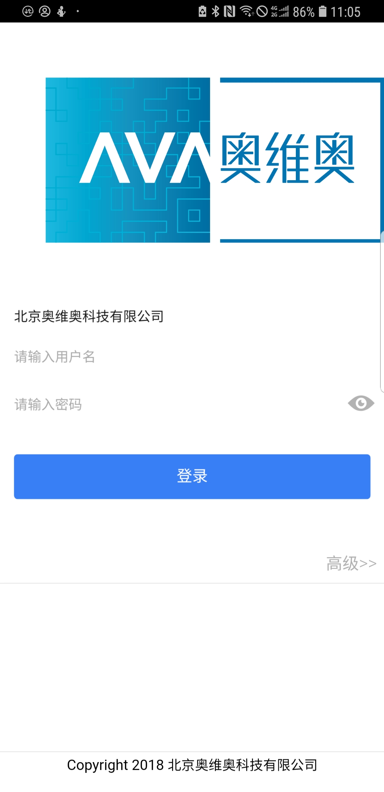                                                                                                                           

​                                                          图 3.1 登录界面

### 3.2 库存任务应用

#### 3.2.1 功能说明

B1端的管理人员将订单推送到APP前端，库管员需要在库存任务中查看这些订单也就是库存任务。

#### 3.2.2 操作步骤

用户点击库存任务图标，打开库存任务如下图所示，

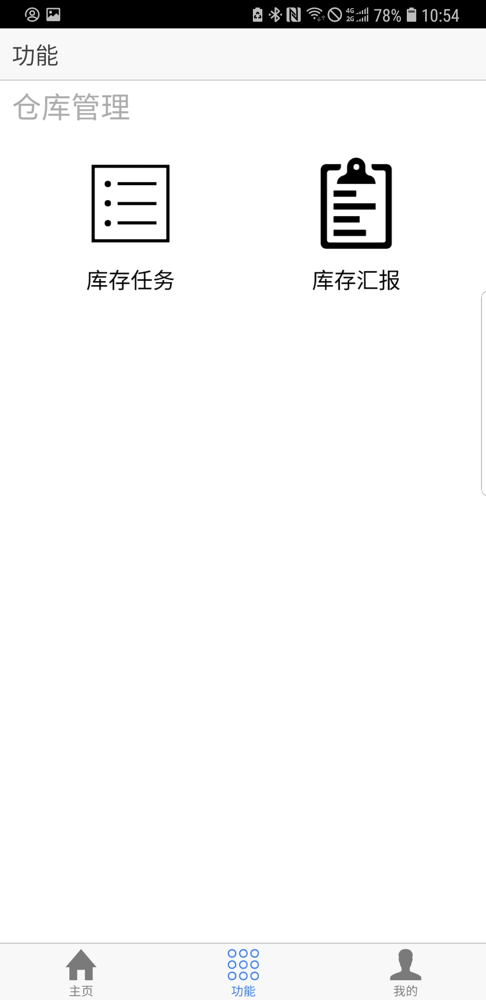

​                                                                

​                  图 3.1 功能界面

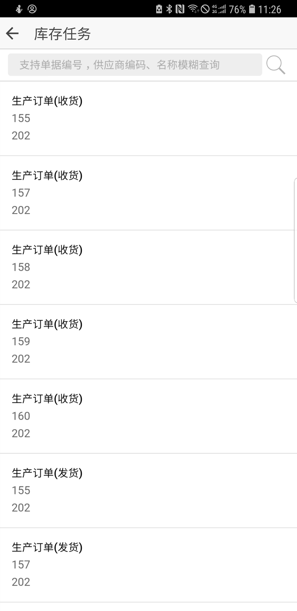

​                                                                    图3.2 库存任务列表

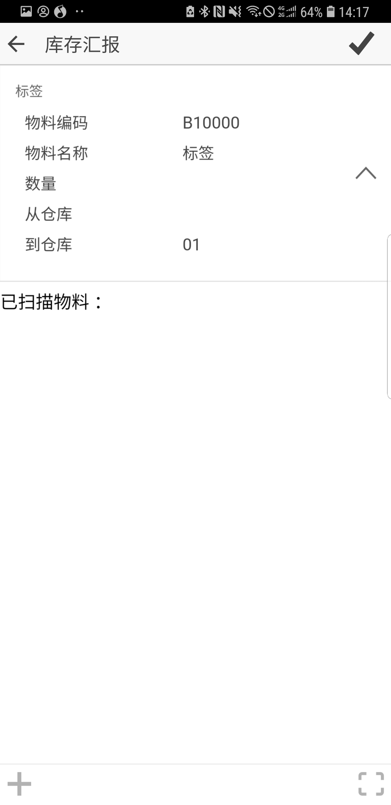

​                                                 图3.3 库存汇报界面

* 用户可以查看所有的库存任务，倘若用户想查看某一单详情，或者是优先做某个任务可以根据订单编号，供应商名称，供应商编码来来查询到这一单。
* 点击库存任务中的行信息进去查看库存任务详情，在库存任务详情界面用户可以查看当前任务的物料信息。
* 当查看完毕所有信息之后选择是否进行下一步操作即库存汇报，库存汇报根据当前订单的物料信息添加物料，决定做库存汇报，点击页面又下角的箭头进行汇报操作，不汇就报点击又上角的箭头返回。

#### 3.3 添加物料

##### 3.3.1功能说明

库管员选择库存汇报即要添加物料，添加物料主要有两种方式，第一通过手机扫描的方式添加，第二通过手动添加的方式添加，具体操作方式由现场环境来决定

##### 3.3.2 操作步骤

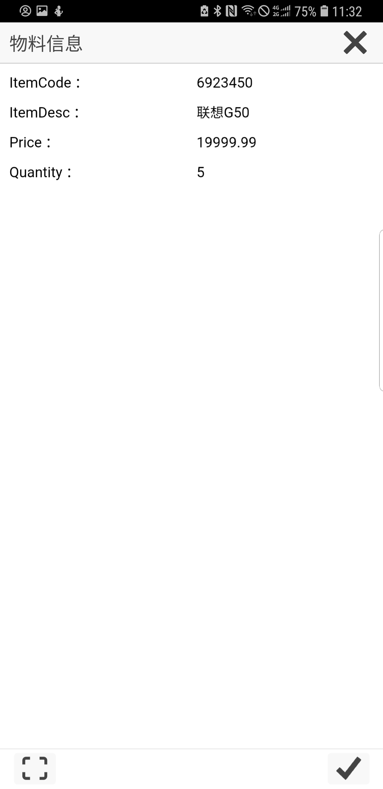

​                                          图3.4 扫描物料信息界面

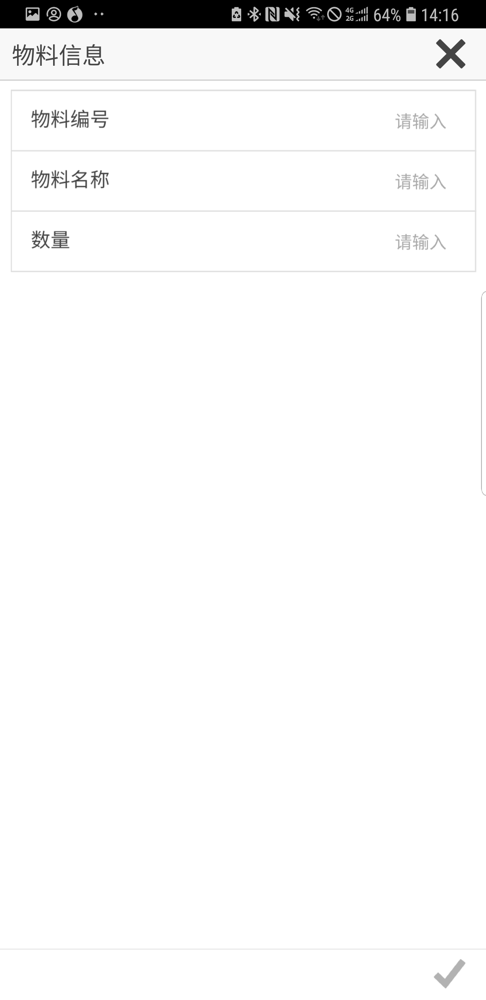

​                                             图3.5 手动添加物料界面

* 库管人员在此页面上点开隐藏的物料信息，根据页面上的物料信息去添加物料。
* 点击右下角扫描按钮，扫描成功物料信息会在一个物料信息的窗口弹出，核对物料信息，如果核实无误点击右下角的对号按钮保存物料信息。
* 如果物料信息有误可以点击右上角的“X”取消保存，也可以点击左下角的按钮重新扫描。
* 物料信息保存完毕之后页面会跳转到库存汇报页面，可以继续添加物料，当所有的物料都添加完毕之后或者暂时添加点击库存汇报页面右上角的对号点击保存生成单据可以在库存汇报功能中查看和修改。

#### 3.4 库存汇报应

##### 3.4.1 功能说明

在库存任务汇报这个功能中可以查看库存汇报历史以及库存汇报明细，还可以对已经汇报完的库存任务进行删除编辑和修改。

##### 3.4.2操作步骤

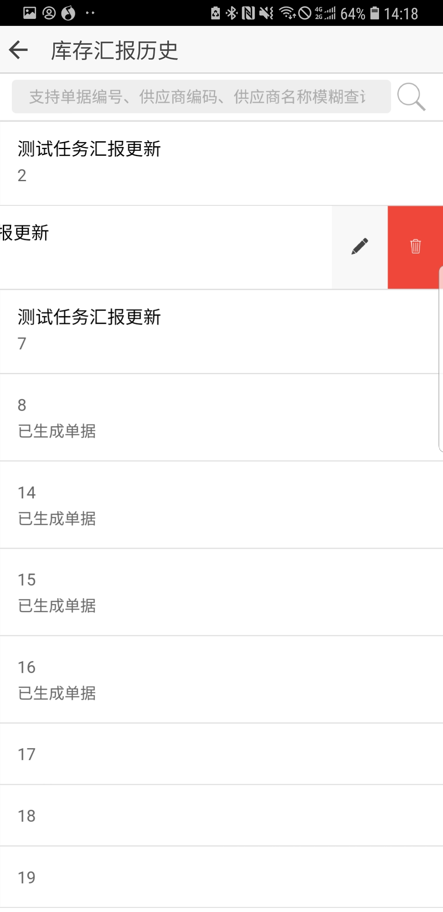

​                                                   图3.5 库存汇报历史界面

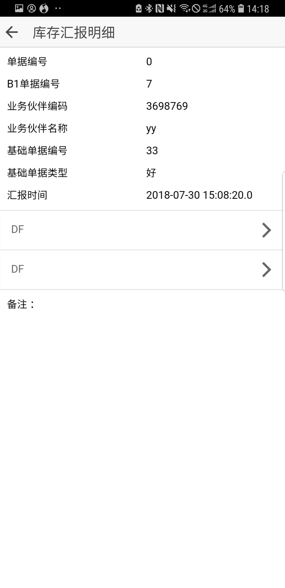

​                                                         图3.6 库存汇报明细界面

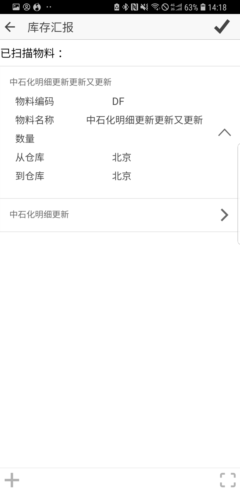

​                                                            图3.7 库存汇报编辑界面

* 点击库存汇报图标进入库存汇报历史界面，此界面显示了所有已经汇报过的库存任务。
* 点击一行汇报过的库存任务可以查看库存任务详情
* 左划一行可以选择是编辑还删除这一行。
* 选择编辑即可以对这个库存任务重新汇报，具体操作与库存任务中 的库存汇报操作相同。

#### 3.5 库存汇报的删除与更新

##### 3.5.1 功能说明

当一个库存任务汇报结束，且已经生成单据，则在库存汇报历史中是禁止对于这项库存任务有任何操作的，即状态是不可更改的，倘若还未生成单据这这项库存任务在库存汇报历史中仍然是可以更改的，如果在库存汇报历史中删除某一行，删除过后可以在库存任务中对于这项任务继续汇报。具体说明如下图所示，

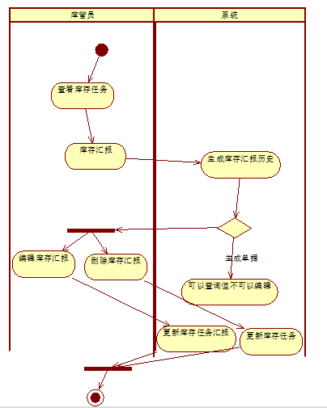

